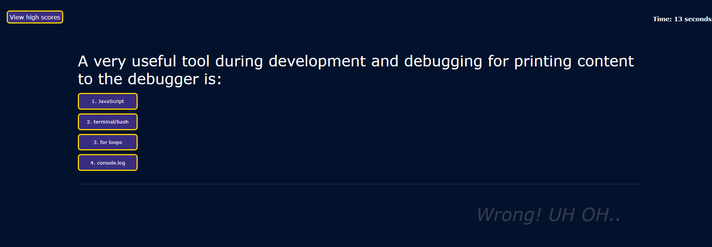

# Javascript-Code-Quiz

## Do you know Javascript? Find out!

### This is a simple Timed Javascript Quiz.

### Rules:

* Click 'Start Quiz' button to render questions and start the timer;
* Choose an answer by clicking one of four choices buttons;
* If you answer correctly your score will go up, and be counted as % at the end of the quiz;
* If you answer wrong the timer will penalize 10 seconds( 10 sec will be taken out of the remaining time);
* The Quiz is over when timer reaches '0' or when you answer all the questions;
* At the end of the Quiz you are asked to enter your initials, so the score can be saved;
* You can check the Highscores anytime by simply click the 'view high scores' button.

## Links:

* Live page:  https://vitokwolf.github.io/Javascript-Code-Quiz/
* GitHub : https://github.com/vitokwolf/Javascript-Code-Quiz

